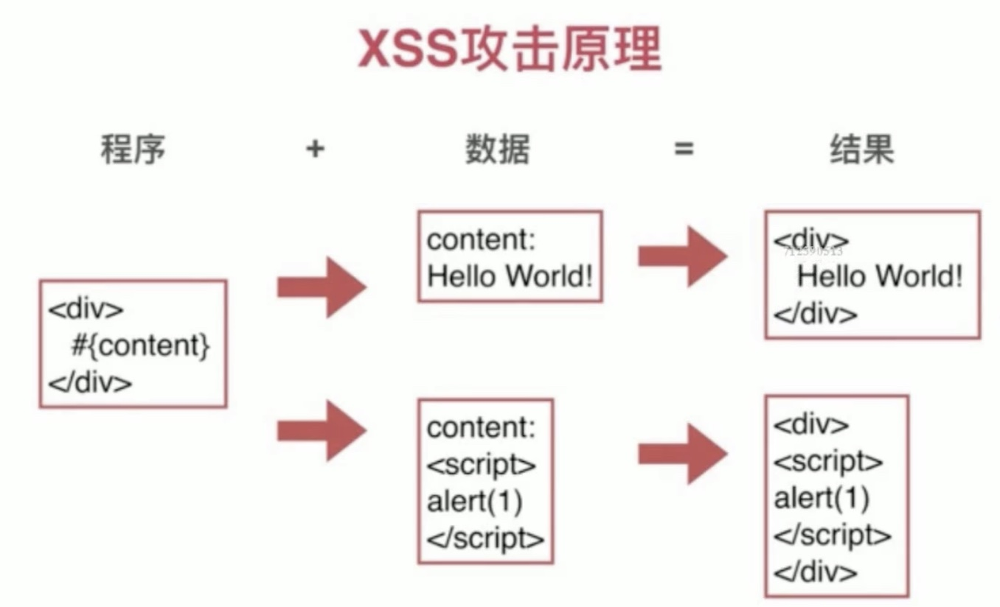
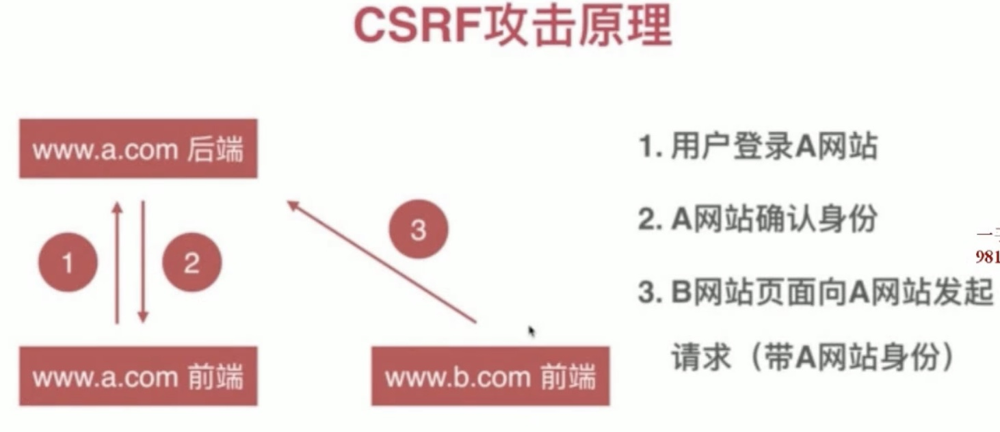
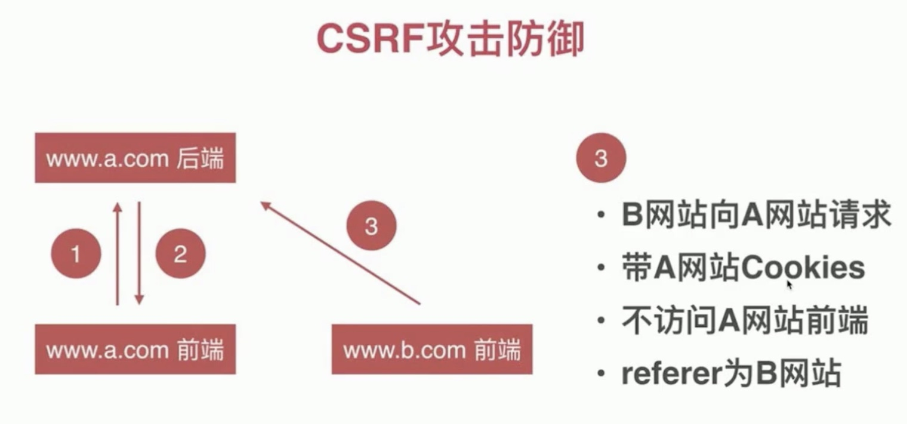
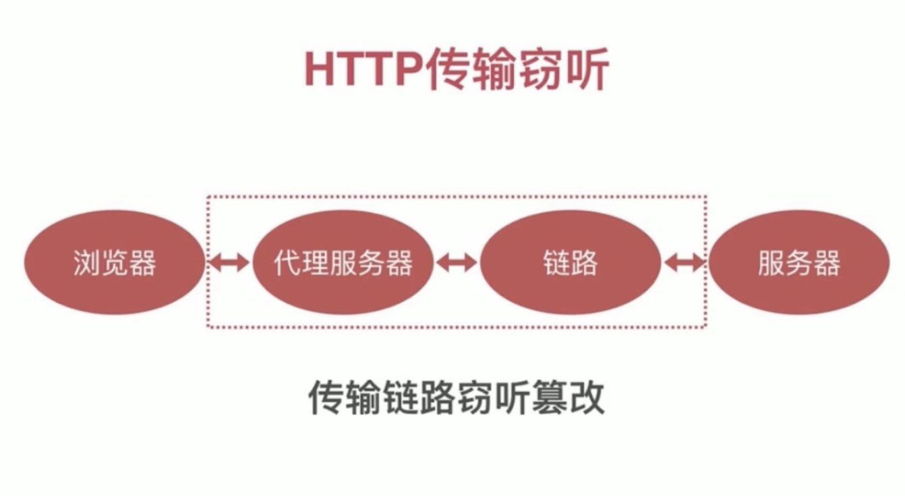
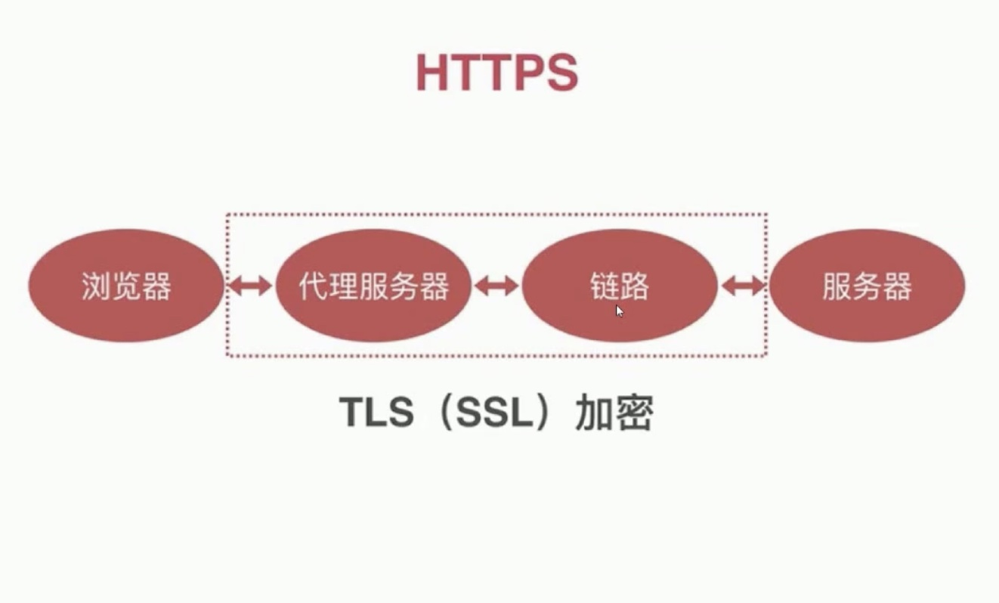
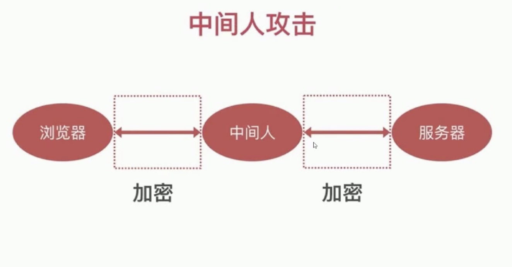
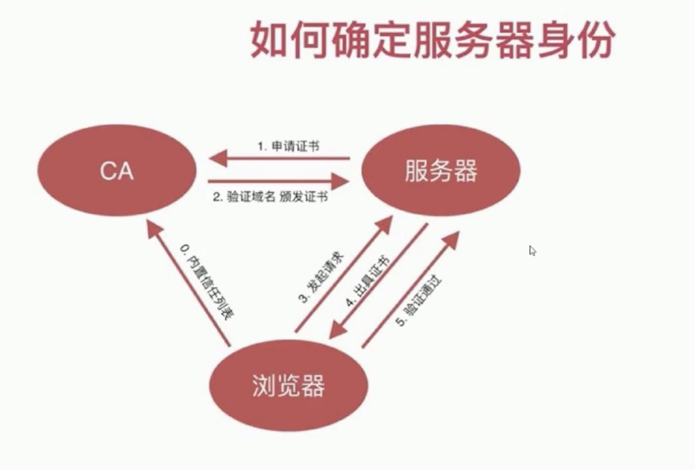

# Web-Security
## XSS(Cross Site Scripting)跨站脚本攻击

### 演示

    url输入`http://localhost/?from=google<script>alert(1)<script/>`
### 原理

    content有数据变成了script脚本程序
### 危害

    1. 获取页面数据
    2. 获取Cookies: 通过document.cookie
    3. 劫持前端逻辑
    4. 发送请求
    5. 偷取网站任意数据
    6. 偷取用户资料
    7. 偷取用户密码登录态
    8. 欺骗用户
    9. .....
### 分类

    1. 反射型
      - url参数直接注入
      - url中会暴露脚本, 相对来说没有存储型隐蔽
    2. 存储型
      - 存储到DB后读取时注入
      - 评论中写入脚本, 当其他用户访问该评论页面时, 这条评论的内容会从数据库中取出所存储的脚本运行, 从而攻击用户
      - 危害更大, 因为更隐蔽
### XSS攻击注入点

  1. HTML节点内容

    如果节点的内容是动态生成, 包含用户输入的信息, 可能被插入脚本
  2. HTML属性
    
  ```html
  <!-- 属性为用户输入, 可能被输入脚本 -->
  
  
  <!-- http://localhost/?image=1" onerror=alert(1) -->
  ```
  3. js代码
  ```js
  let data = "#{data}";
  // hello";alert(1);"    --> 黑客输入的内容
  let data = "hello";alert(1);"";
  ```
  4. 富文本

    - 一大段的html, 有个格式, 难点在于要区别用户插入的script脚
    - 比如qq邮箱的编辑器
    - 富文本得保留html
    - html有XSS攻击的风险
### 防御
  1. 浏览器的防御: 

    - X-XSS-Protection
    - 只防御反射型的XSS
    - 只防御出现在html内容和html属性中的
  ---
  2. html节点内容的防御: 

    - 对输入的内容进行转义: <&lt;和>&gt;
      1. 进入数据库之前进行转义
      2. 进行显示的时候转义
  ```js
  function escapeHtml(str) {
    str = str.replace(/</g, '&lt;')
    str = str.replace(/>/g, '&gt;')
  }
  ```
  3. html属性的防御

    1. 转义引号
    2. 转义空格
      
  ```js
  function escapeHtmlProperty(str) {
    if (!str) return '';
    str = str.replace(/"/g,'&quot;')
    str = str.replace(/'/g, '&#39')
    str = str.replace(/ /g, '&#32')
  }
  ```
  > html内容和属性的转义可以合并起来, 但是会有问题: 空格, 所以不要对空格转义
  ```js
  function escapeHtml(str) {
    if (!str) return '';
    str = str.replace(/&/g,'&amp')
    str = str.replace(/</g, '&lt;')
    str = str.replace(/>/g, '&gt;')
    str = str.replace(/"/g,'&quot;')
    str = str.replace(/'/g, '&#39')
  }
  ```
  4. js XSS攻击防御

    对数据中的引号进行转义, 但不能转义为html实体, 因为js识别不了
    1. 对引号转义
    2. 对斜杠\转义
    3. 最终方案: 最数据进行JSON.stringify
  5. 富文本的格式的防御

    - 黑名单的风险: 有太多的html标签和属性需要过滤
    - 所以按白名单保留部分标签和属性
    - 使用专门的xss过滤库: install xss
  6. CSP防御

    用于指定哪些内容可以执行, 没有指定的全部不信任`default-src self`
## CSRF(Cross Site Request Forgy)跨站请求伪造
### 变种
    1. POST请求的话构造form表单,通过iframe跳转
    2. Get请求,通过<a>, 内容中再添加a标签进行跳转
### 原理

### CSRF危害
    1. 利用用户登录态
    2. 用户不知情
    3. 完成业务请求
    4. 盗取用户资金
    5. 冒充用户发帖背锅
### CSRF防御

  1. cookie

    - 禁止第三方网站带Cookies
    - same-site属性
  2. 不访问A网站前端

    - 在前端页面加入验证信息
    - 验证码
      攻击者网站不访问被攻击网站的前端所以拿不到验证码, 所以不能通过验证
    - token
      实现方式: 后端给前端的某个隐藏表单中加入token, 同时cookies中带有相同的token, 刚提交请求时, 验证cookies中的token和表单中的token是否相同, 因为CSRF不访问被攻击者的前端, 所以http请求中不会带有表单中的token值,所以可以防御
      token的存储方式: 表单中的值/meta中/
  3. referer为B网站

    referer是http协议中的一个请求头, 会标明该请求来自哪里
    - 验证referer
  ```js
  if(/^https?:\/\/localhost/.test(referer)){
    throw new Error('非法请求')
  }
  ```
## Cookies
### 特性

    - 前端数据存储
    - 后端通过http头设置
    - 请求时通过http头传给后端
    - 前端可读写
    - 遵守同源策略
      - 协议,域名,端口
---
    - 域名
    - expires(有效期)
    - 路径
      cookies可以作用于网站的哪一级, 只在当前路径下有效
    - http-only
      cookie只能在http协议中使用, js中无法使用
    - secure
      cookie只能在https中使用
    > 在chrome devtools的cookies中可以看路径
### 作用
    - 存储个性化设置
    - 存储未登录时用户唯一标识
    - 存储已登录用户的凭证
    - 存储其他业务数据
登录用户凭证
    
    - 前端提交用户名和密码
    - 后端验证用户名和密码
    - 后端通过http头设置用户凭证
    - 后续访问时后端先验证用户凭证
---
    - 用户ID
      有隐患, 可以篡改cookie中的id来伪装用户
    - 用户ID + 签名
      签名是用算法算出id的复杂字符串, 不可逆, 通过设置一个签名和id的cookie, 根据传过来的签名和id, 通过id算出签名是否和传过来的签名一致来判断是否是该用户
    - SessionId
      把用户的登录数据(session对象)放入服务端的内存中, 通过给前端发送一个随机的数, 下次用户请求时带上这个随机数, 服务端根据这个数找到对应的session, 从而得到用户的登录信息.
      服务器重启时, session会丢失, 可以存储在外存上
    - token
### cookies和XSS的关系
    - XSS可能偷取Cookies(Document.cookie)
    - http-only时cookie不会被偷
### cookies和CSRF的关系
    - CSRF利用了用户Cookies
    - 攻击站点无法读写Cookies
    - 最好能组织第三方使用cookies: same-site
### Cookies-安全策略
    - 签名防篡改
      明文和签名都有, 只是验证该明文是否和该签名对应
    - 私有变换(加密)
      加密没有明文
    - http-only(防止XSS)
    - secure(https)
    - same-site(防止CSRF,只兼容chrome)
## 点击劫持
通过iframe将目标网站放到页面上, 把iframe的透明度设为0, 诱导用户点击目标网站

    - 用户亲手操作
    - 用户不知情
    - 盗取用户资金
    - 获取用户敏感信息
防御
  
    - 用js禁止iframe内嵌
      内嵌时top!=window, 但js可被禁止
    - X-FRAME-OPTIONS禁止内嵌, 可以禁止被iframe内嵌
    - 验证码
## 传输安全

通过traceroute + 域名 命令可以查看传输的节点

    通过中间代理可以篡改http内容
### HTTP窃听

    - 窃听用户密码
    - 窃听传输敏感信息
    - 非法获取个人资料
### HTTP篡改

    - 插入广告
    - 重定向网站
    - 无法防御的XSS和CSRF攻击
    > 案例
      运营商劫持
      广告
      非该网站内容
      局域网劫持
      公共wifi获取密码
### HTTPS


证书认证


    - 证书无法伪造
    - 证书的私钥不被泄露
    - 域名管理权不泄露
    - CA坚守原则
> 通过keycha查看浏览器的证书信任列表
推荐用switchhost来配置host
## 密码安全
### 密码的作用
    证明你是你, 对比: 存储的密码←→输入的密码
  泄露渠道
    
    - 数据库被偷
    - 服务器被入侵
    - 通讯被窃听
    - 内部人员泄露
    - 其他网站(撞库)

### 密码的存储
    - 严禁明文存储(防泄漏)
    - 单向变化(防泄漏)
    - 变换复杂度要求(防猜解)
    - 密码复杂度要求(防猜解)
    - 加盐(防猜解)
      帮助用户加强复杂度, 
  哈希算法

    - 明文-密文 一一对应
    - 雪崩效应
    - 密文-明文 无法反推
    - 密文固定长度
    - 常见的哈希算法: md5 sha1 sha256
      交换次数越多越难破解

  > 彩虹表: 原文-密文的map表
  > 不要明文存储密码
### 密码的传输
    - https传输
    - 频率限制
    - 前端加密意义有限
### 密码的替代方案
### 生物特征密码
    - 指纹
    - 声纹
    - 虹膜
    - 人脸
---
    私密性 - 容易泄露
    安全性 - 碰撞
    唯一性 - 终身唯一 无法修改
## 信息泄露
OAuth思想

    - 一切行为由用户授权
    - 授权会过期